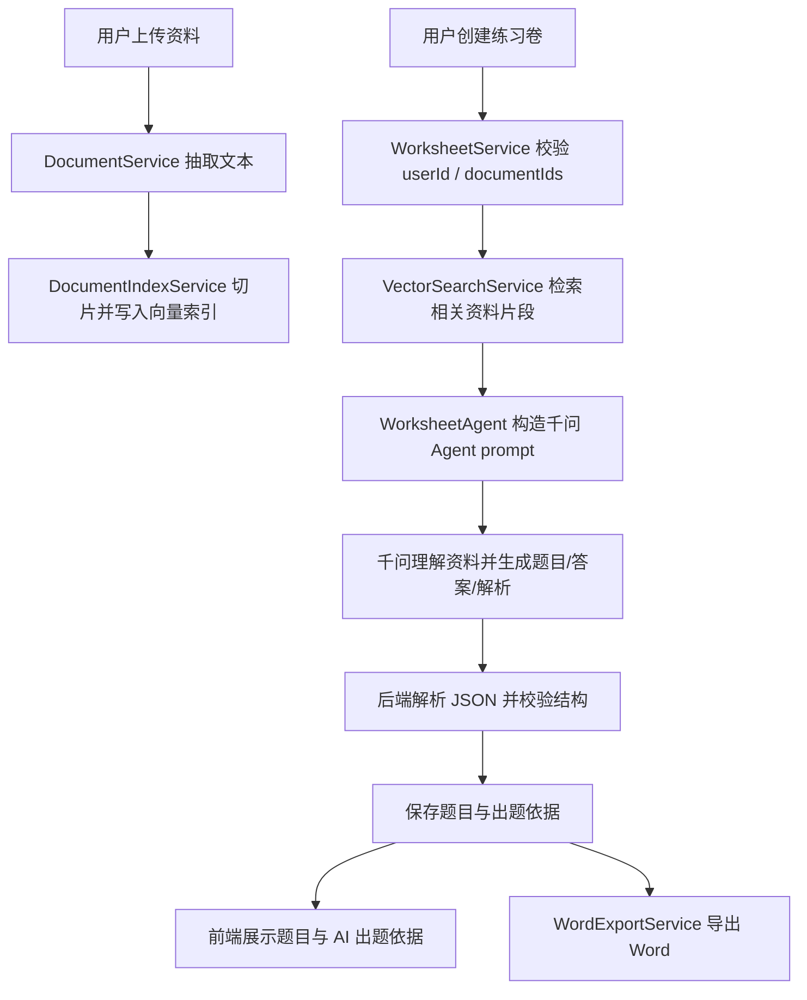

# Qwen Worksheet Agent Design

## Goal

将当前 EduSpark 的练习卷生成从“固定模板/固定 prompt 出题”升级为“千问驱动的教育出题 Agent”。系统继续负责用户隔离、文件上传、文本抽取、向量检索、数据持久化和 Word 导出；千问 Agent 负责阅读资料片段、抽取知识点、规划题型与难度、生成题目、答案和解析。

## Selected Approach

采用混合方案：

- 系统层负责安全边界和确定性数据流。
- 千问 Agent 负责教学理解和生成决策。
- 接入方式采用 DashScope OpenAI-compatible API，复用 Spring AI `ChatClient` / OpenAI client 体系。
- 题型、题量、难度采用半约束：用户设置是偏好，Agent 可以基于资料内容合理调整，但必须返回调整原因。

## Current Code Context

当前项目已经具备部分基础：

- `WorksheetService` 负责创建练习卷、检索文档 chunk、保存结果。
- `WorksheetGenerationStrategy` 已经抽象出练习卷生成策略。
- `SpringAiWorksheetGenerator` 已经支持通过 `ChatClient` 调用模型。
- `WorksheetPromptBuilder` 已经存在，但 prompt 更偏固定格式生成。
- `WorksheetQuestionOutputParser` 已经使用结构化输出解析。
- `MockWorksheetGenerator` 提供本地 mock 兜底。

本次设计重点不是重写全部流程，而是把现有 AI 出题策略升级为真正的 Agent 风格生成。

## Target Flow



## Responsibility Boundary

### System Responsibilities

- JWT 登录态与 `userId` 路径隔离。
- 文件上传、存储和文本抽取。
- 文档切片、embedding 和 MySQL JSON 向量索引。
- 从当前用户指定文档中检索相关 chunk。
- 保存练习卷配置、题目、状态和出题依据。
- Word 导出。
- 校验模型输出是否可解析、是否满足最低质量规则。

### Qwen Agent Responsibilities

- 阅读系统提供的参考材料片段。
- 抽取核心知识点、易错点和适合考查的能力点。
- 根据年级、难度、题量和题型偏好规划题目。
- 生成题目、答案和解析。
- 当资料不足时减少题目数量并说明原因，不编造资料外事实。
- 返回严格 JSON。

### Hard Boundaries

- 千问不能直接访问数据库。
- 千问不能绕过 `userId` 权限。
- 千问只能看到当前请求中系统检索出的资料片段。
- 千问输出必须经过后端 parser 校验后才能保存。

## Semi-Constrained Generation Rules

- `questionCount` 是目标题量，允许上下浮动 20%，但至少 1 题。
- `questionTypes` 是偏好题型，Agent 优先满足，但可根据资料内容合理调整。
- `difficulty` 是目标难度，Agent 可做分层安排。
- `gradeLevel` 是硬约束，不能明显超纲。
- `includeExplanation=true` 时，每题必须有解析。
- 如果偏离用户偏好，必须在 `generationRationale.deviationFromPreference` 中说明。

## Data Contract

新增或调整 Agent 结果对象：

```ts
interface WorksheetAgentResult {
  generationRationale: WorksheetGenerationRationale;
  questions: GeneratedWorksheetQuestion[];
}

interface WorksheetGenerationRationale {
  summary: string;
  keyPoints: string[];
  difficultyPlan: string;
  typePlan: string;
  deviationFromPreference?: string;
}

interface GeneratedWorksheetQuestion {
  type: string;
  stem: string;
  options: string[];
  answer: string;
  explanation: string;
  difficulty: string;
  sourceQuote?: string;
}
```

`WorksheetDetailResponse` 增加：

```ts
generationRationale?: WorksheetGenerationRationale;
```

数据库建议：

- `edu_worksheet.questions_json` 继续保存最终题目数组，保持现有兼容。
- `edu_worksheet.config_json` 继续保存原始请求。
- 新增 `edu_worksheet.generation_rationale_json` 保存 Agent 出题依据。

## Prompt Design

### System Prompt

```text
你是 EduSpark 的教育出题 Agent，擅长根据教师上传的课堂资料生成练习题。

你的职责：
1. 阅读参考材料，抽取核心知识点、易错点和适合考查的能力点。
2. 根据教师给出的年级、难度、题量和题型偏好，生成适合学生练习的题目。
3. 题型和题量是偏好，不是死命令；如果材料更适合调整题型或题量，你可以调整，但必须说明原因。
4. 每道题必须给出答案；当要求解析时，必须给出清晰解析。
5. 所有题目必须基于参考材料，不允许编造材料外事实。
6. 如果材料不足以支撑指定题量，应生成较少题目，并在 deviationFromPreference 中说明。
7. 只输出 JSON，不输出 Markdown，不输出额外解释。
```

### User Prompt

```text
请基于以下资料生成练习卷。

教师偏好：
- 标题：{title}
- 年级：{gradeLevel}
- 目标题量：{questionCount}
- 偏好题型：{questionTypes}
- 目标难度：{difficulty}
- 是否需要解析：{includeExplanation}

半约束规则：
- 题量允许在目标值上下 20% 内浮动。
- 题型优先遵循偏好，但可根据资料内容合理调整。
- 年级是硬约束，不得超纲。
- 如果偏离偏好，必须在 deviationFromPreference 说明。

参考材料片段：
[chunk-1]
{content}

[chunk-2]
{content}

请完成：
1. 抽取资料中的核心知识点。
2. 规划题型和难度分布。
3. 生成题目、答案和解析。
4. 输出严格 JSON。

{format}
```

## Qwen Configuration

采用 DashScope OpenAI-compatible：

```yaml
spring:
  ai:
    model:
      chat: openai
    openai:
      base-url: ${SPRING_AI_OPENAI_BASE_URL:https://dashscope.aliyuncs.com/compatible-mode}
      api-key: ${DASHSCOPE_API_KEY:}
      chat:
        model: ${SPRING_AI_OPENAI_CHAT_MODEL:qwen-plus}
        temperature: 0.3
```

本地启动环境变量：

```powershell
$env:DASHSCOPE_API_KEY="<dashscope-api-key>"
$env:SPRING_AI_OPENAI_BASE_URL="https://dashscope.aliyuncs.com/compatible-mode"
$env:SPRING_AI_OPENAI_CHAT_MODEL="qwen-plus"
$env:AGENT_PLANNER_MODE="spring-ai"
```

安全要求：

- `application.yml` 不允许硬编码任何真实 API Key。
- 默认 key 必须为空。
- 本地、测试、生产均通过环境变量注入。

## Error Handling

第一版采用简单可靠策略：

- 资料为空或无可用文本：返回 `400`。
- 千问请求失败：返回 `502`，练习卷状态置为 `FAILED`。
- 千问返回非 JSON：返回 `502`，状态置为 `FAILED`。
- JSON 可解析但缺少必要字段：返回 `502`。
- 题量超出半约束范围：返回 `502`。
- 选择题缺少选项：返回 `502`。
- `includeExplanation=true` 但缺少解析：返回 `502`。

后续可增加一次自动修复重试：将 parser 错误作为反馈重新请求模型。

## Frontend Changes

- 练习卷详情展示 `generationRationale`。
- 在题目预览上方增加“AI 出题依据”区域。
- 展示资料摘要、知识点、题型安排、难度安排、偏离偏好说明。
- Word 导出可在文档开头加入“AI 出题依据”。

## Testing

后端测试：

- Qwen 配置不硬编码 key。
- `WorksheetPromptBuilder` 生成 prompt 包含半约束规则、资料 chunk、输出格式。
- Parser 能解析 `generationRationale + questions`。
- Parser 拒绝缺少答案、缺少解析、题量越界、选择题缺少选项的输出。
- `WorksheetService` 保存 `generation_rationale_json`。
- Mock 策略继续可用于测试环境。

前端测试：

- 生成练习卷后显示 AI 出题依据。
- 无 `generationRationale` 时页面不崩溃。
- 导出 Word 按原流程工作。

## Out of Scope

- 不让千问直接访问数据库。
- 不实现复杂多轮工具调用协议。
- 不新增任务历史 Dashboard。
- 不实现模型自动重试多轮优化，第一版只预留错误反馈结构。
- 不接入 DashScope 原生 SDK。
