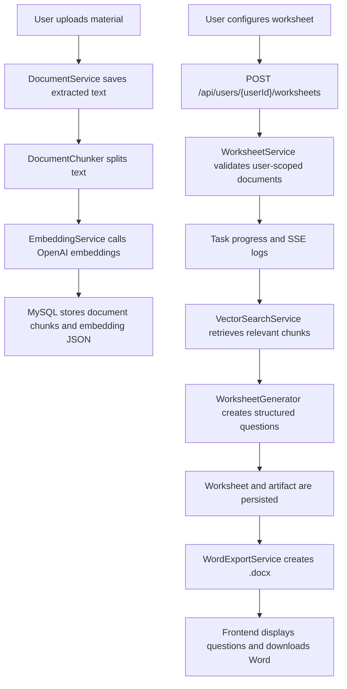

# EduSpark Worksheet Vector Word Design

## Summary

EduSpark Agent will add a first version of worksheet generation from uploaded learning materials. The feature will reuse the existing user-scoped document, task, SSE, and artifact architecture. After a user uploads materials, the backend will split extracted text into chunks, generate OpenAI embeddings, and store vectors in MySQL as JSON. When the user requests a worksheet, the backend will retrieve relevant chunks, generate structured questions, display them in the current workspace, and export a Word document containing questions followed by answers and explanations.

The first version targets practical primary and secondary school practice worksheets. It will not implement a full question bank, advanced paper templates, automatic grading, or a dedicated vector database.

## Goals

- Generate worksheet questions from uploaded materials.
- Support standard controls: title, document selection, question count, grade level, difficulty, question types, and whether explanations are included.
- Store material chunks and embeddings in MySQL with user isolation.
- Retrieve relevant chunks before generation to reduce prompt size and improve grounding.
- Export one `.docx` file that contains a question section and an answer/explanation section.
- Keep existing JWT user isolation, task progress, SSE stream, and artifact display behavior.

## Non-Goals

- Question bank management.
- Advanced worksheet history filters.
- Manual question editing.
- Multiple Word templates.
- Qdrant, Milvus, Chroma, or another external vector database.
- Similar-question deduplication.
- Automatic scoring or student submissions.
- Role-based permissions beyond the current user scope.

## Recommended Approach

Use the existing `Task` and `Artifact` flow instead of creating an independent quiz platform. This keeps the implementation aligned with the current architecture:

- `document` continues to handle upload and text extraction.
- A new vector/indexing component handles chunking, embeddings, persistence, and retrieval.
- A new `worksheet` component handles worksheet configuration, generation, persistence, and Word export.
- `task` and `artifact` continue to provide progress, logs, and generated outputs.

This approach minimizes duplicated workflow code and keeps the first version small enough to implement and test safely.

## Data Flow



## Database Design

```sql
create table edu_document_chunk (
  id varchar(36) primary key,
  user_id varchar(36) not null,
  document_id varchar(36) not null,
  chunk_index int not null,
  content longtext not null,
  embedding_json longtext not null,
  token_count int null,
  created_at datetime not null,
  index idx_chunk_user_document (user_id, document_id, chunk_index),
  index idx_chunk_user_created (user_id, created_at)
);

create table edu_worksheet (
  id varchar(36) primary key,
  user_id varchar(36) not null,
  task_id varchar(36) null,
  title varchar(255) not null,
  document_ids longtext not null,
  config_json longtext not null,
  questions_json longtext null,
  status varchar(32) not null,
  created_at datetime not null,
  updated_at datetime not null,
  index idx_worksheet_user_created (user_id, created_at)
);

create table edu_worksheet_export (
  id varchar(36) primary key,
  user_id varchar(36) not null,
  worksheet_id varchar(36) not null,
  file_name varchar(255) not null,
  storage_path varchar(512) not null,
  created_at datetime not null,
  index idx_export_user_worksheet (user_id, worksheet_id)
);
```

Embeddings are stored as JSON text in MySQL for the first version. Similarity search will load the current user's relevant chunks and compute cosine similarity in application code. This is acceptable for a small local/RDS dataset and keeps deployment simple.

## API Contracts

All endpoints are user-scoped and require `Authorization: Bearer <jwt>`. The `{userId}` path segment must match the JWT subject.

### Create Worksheet

`POST /api/users/{userId}/worksheets`

Request:

```json
{
  "title": "比例应用题练习",
  "documentIds": ["doc-1"],
  "questionCount": 10,
  "gradeLevel": "六年级",
  "difficulty": "MEDIUM",
  "questionTypes": ["SINGLE_CHOICE", "FILL_BLANK", "SHORT_ANSWER"],
  "includeExplanation": true
}
```

Response:

```json
{
  "worksheetId": "string",
  "taskId": "string",
  "status": "PENDING"
}
```

### Get Worksheet

`GET /api/users/{userId}/worksheets/{worksheetId}`

Response:

```json
{
  "id": "string",
  "userId": "string",
  "taskId": "string",
  "title": "比例应用题练习",
  "documentIds": ["doc-1"],
  "config": {
    "title": "比例应用题练习",
    "documentIds": ["doc-1"],
    "questionCount": 10,
    "gradeLevel": "六年级",
    "difficulty": "MEDIUM",
    "questionTypes": ["SINGLE_CHOICE", "FILL_BLANK", "SHORT_ANSWER"],
    "includeExplanation": true
  },
  "questions": [
    {
      "id": "q-1",
      "type": "SINGLE_CHOICE",
      "stem": "题干",
      "options": ["A. ...", "B. ...", "C. ...", "D. ..."],
      "answer": "A",
      "explanation": "解析",
      "difficulty": "MEDIUM",
      "sourceChunkIds": ["chunk-1"]
    }
  ],
  "status": "COMPLETED",
  "createdAt": "ISO-8601 datetime",
  "updatedAt": "ISO-8601 datetime"
}
```

### Export Word

`GET /api/users/{userId}/worksheets/{worksheetId}/export.docx`

Response content type:

```text
application/vnd.openxmlformats-officedocument.wordprocessingml.document
```

The Word document contains:

1. Worksheet title.
2. Basic information: grade level, difficulty, question count, generation time.
3. Question section grouped by question type.
4. Answer and explanation section.

## DTOs

```ts
export type WorksheetDifficulty = "EASY" | "MEDIUM" | "HARD";

export type WorksheetQuestionType =
  | "SINGLE_CHOICE"
  | "MULTIPLE_CHOICE"
  | "TRUE_FALSE"
  | "FILL_BLANK"
  | "SHORT_ANSWER";

export interface WorksheetCreateRequest {
  title: string;
  documentIds: string[];
  questionCount: number;
  gradeLevel: string;
  difficulty: WorksheetDifficulty;
  questionTypes: WorksheetQuestionType[];
  includeExplanation: boolean;
}

export interface WorksheetQuestion {
  id: string;
  type: WorksheetQuestionType;
  stem: string;
  options?: string[];
  answer: string | string[];
  explanation?: string;
  difficulty: WorksheetDifficulty;
  sourceChunkIds: string[];
}

export interface Worksheet {
  id: string;
  userId: string;
  taskId?: string;
  title: string;
  documentIds: string[];
  config: WorksheetCreateRequest;
  questions: WorksheetQuestion[];
  status: "PENDING" | "GENERATING" | "COMPLETED" | "FAILED";
  createdAt: string;
  updatedAt: string;
}
```

## Backend Components

### Document Indexing

- `DocumentChunker`: splits extracted text into 800-1200 character chunks.
- `EmbeddingService`: calls OpenAI embeddings in `openai` mode and returns deterministic mock vectors in `mock` mode.
- `DocumentChunkMapper`: persists chunk text and embedding JSON.
- `DocumentIndexService`: coordinates chunk creation after upload.

If embedding fails during upload, the document remains uploaded. The backend records the failure and worksheet generation can fall back to extracted text snippets.

### Worksheet Generation

- `WorksheetController`: exposes create, get, and export endpoints.
- `WorksheetService`: validates request data, user-scoped document ownership, worksheet state, and retrieval.
- `VectorSearchService`: computes cosine similarity over the current user's chunks.
- `WorksheetGenerator`: generates strict worksheet JSON from retrieved chunks.
- `WordExportService`: creates and stores `.docx` files.

In `mock` mode, generation should produce stable sample questions for local development and tests. In `openai` mode, generation should request strict JSON and validate it before saving.

### Word Export

Use Apache POI for `.docx` creation. Generated files are stored under:

```text
storage/exports/{userId}/{worksheetId}.docx
```

The export endpoint may reuse an existing file when worksheet content has not changed.

## Frontend Changes

The existing workspace gains a worksheet mode. It does not replace the current agent task composer.

New UI elements:

- Mode switch: agent task / worksheet generation.
- Worksheet configuration panel:
  - title
  - grade level
  - question count
  - difficulty
  - question type multi-select
  - include explanations toggle
  - selected material chips
- Generate worksheet button.
- Structured question result panel.
- Download Word button.

Behavior:

- Disable generation until at least one uploaded document is selected.
- Show progress through existing task/SSE timeline when a task id is returned.
- Show a friendly warning when indexing is unavailable and the backend uses fallback text.
- Clear worksheet draft and result state on logout.

## Error Handling

- `400`: invalid worksheet parameters, no documents, unsupported question types, out-of-range question count.
- `401`: missing, invalid, or expired JWT.
- `403`: path user id does not match JWT subject.
- `404`: worksheet, document, chunk, or export is not visible to the current user.
- `502`: OpenAI embedding or worksheet generation call failed.
- `500`: Word export or storage failure.

OpenAI failures should produce user-readable errors and task logs. The generated worksheet should not be marked `COMPLETED` unless questions pass schema validation.

## Testing Strategy

Backend tests:

- Uploading a document creates `edu_document_chunk` rows.
- Chunks include `user_id`, `document_id`, `chunk_index`, content, and embedding JSON.
- Users cannot access or retrieve another user's chunks.
- Invalid worksheet requests return `400`.
- A worksheet cannot be created from another user's document.
- Mock mode creates a worksheet with structured questions.
- Worksheet retrieval is user-scoped.
- Word export returns the correct content type.
- Generated Word contains title, question section, and answer/explanation section.
- Embedding failure produces fallback behavior or a clear error.
- Existing auth semantics remain intact: `401`, `403`, and scoped `404`.

Frontend tests:

- Worksheet generation is disabled without uploaded materials.
- Worksheet request includes `Authorization` and the user-scoped URL.
- Request body includes document ids and all configured worksheet parameters.
- Generated questions render in the result panel.
- Download Word uses the correct endpoint.
- Logout clears worksheet state.

Verification commands:

```powershell
cd D:\Project\eduspark-agent\backend
& 'C:\Users\27846\.cache\codex-runtimes\apache-maven-3.9.9\bin\mvn.cmd' package

cd D:\Project\eduspark-agent\frontend
& .\node_modules\.bin\vitest.cmd run
& .\node_modules\.bin\tsc.cmd -b
& .\node_modules\.bin\vite.cmd build
```

## Implementation Phases

1. Backend schema and contracts.
2. Document chunking and embedding.
3. Vector retrieval and worksheet generation.
4. Word export.
5. Frontend worksheet mode and result display.
6. End-to-end validation and documentation updates.

## Open Questions Resolved

- Worksheet style: first version supports primary/secondary practice worksheets.
- Word format: one `.docx` with questions first and answers/explanations later.
- Vector store: use OpenAI embeddings stored in MySQL JSON.
- User controls: first version supports standard controls and leaves advanced exam settings for later.
