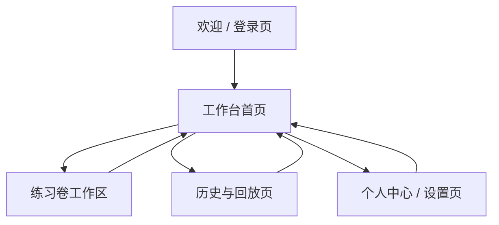
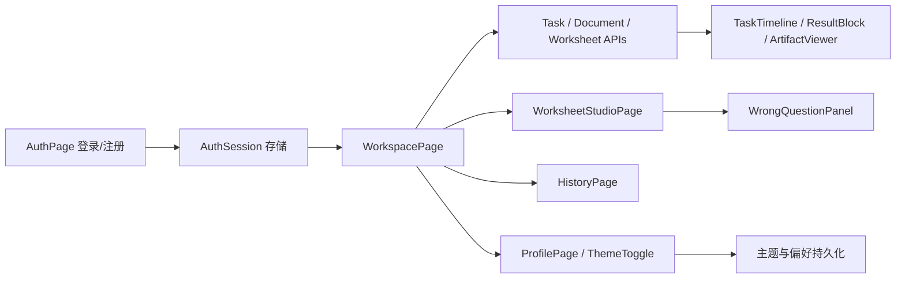

# EduSpark 前端全量重构设计

## 目标

将现有 EduSpark 前端从“单页工作台”重构为一套完整、统一、可扩展的产品界面。整体风格采用 **透明白 + 深沉黑** 的苹果式质感：以浅色液态玻璃为主界面容器，少量深沉黑用于结果预览、强调区和层次锚点，形成“专业、安静、极简但有能量”的教育 AI 工作台。

本轮重构重点是：

- 所有页面统一视觉语言
- 所有页面增加简洁简介
- 登录、工作台、练习、历史、个人中心重新组织
- 主题切换支持柔和液态渐变过渡
- 不改后端 API 契约，不改业务状态机

## 当前基线

当前前端已经具备：

- 登录 / 注册
- JWT 会话持久化
- 任务创建与 SSE 日志
- 文档上传与资料中心
- 练习卷生成、批改、导出
- 错题再练
- 历史任务与知识图谱

当前问题是：

- 页面仍以单工作台思路组织，信息密度高但层次不够清晰
- 视觉风格虽然已有基础，但还不够统一和高级
- 登录页、工作台、练习区、历史区之间缺少明确页面分层
- 主题切换有入口，但缺少完整的渐变过渡和全局视觉联动
- 工作台首页承载了过多历史任务与回放信息，显得杂乱

## 设计原则

1. **GPT 式秩序感**
   - 页面结构清晰
   - 信息优先级明确
   - 使用简洁标题、短简介和分区布局

2. **少量艺术化表达**
   - 使用浅色液态玻璃、轻微渐变、柔和光晕
   - 所有艺术化元素只做增强，不做主角

3. **页面先于组件**
   - 先定义页面层级，再拆共享组件
   - 每个页面都有明确职责，避免单文件继续膨胀

4. **简介可见**
   - 每个一级页面标题下都放一行简介
   - 简介控制在 1 句，帮助用户快速建立场景感

5. **不新增多余依赖**
   - 继续使用 React + Tailwind + lucide-react
   - 不引入新的 UI 框架
   - 路由可采用轻量内部视图切换，不强制新增路由库

## 信息架构

建议将前端组织为以下 5 个一级页面：

1. **欢迎 / 登录页**
2. **工作台首页**
3. **练习卷工作区**
4. **历史与回放页**
5. **个人中心 / 设置页**

页面间关系：

## 页面设计

### 1. 欢迎 / 登录页

页面简介建议：

> 把资料、出题、批改和错题再练收束到一个安静而有力量的工作台。

页面职责：

- 建立产品第一印象
- 完成登录 / 注册 / 验证码
- 提供主题切换入口

布局建议：

- 左侧为品牌叙事区，右侧为登录卡片
- 在桌面端使用双栏，在移动端堆叠
- 卡片不做厚重边框，采用细边框与玻璃质感

视觉细节：

- 背景使用柔和液态渐变
- 顶部有一条极细能量流光
- 登录卡包含图形验证码、主题切换、错误提示

### 2. 工作台首页

页面简介建议：

> 这里是日常主战场，上传资料、创建任务、看进度、读结果都在一页完成。

页面职责：

- 作为登录后的默认首页
- 承载任务输入、资料流、结果展示与当前进度
- 只保留和“当前工作”强相关的信息入口

布局建议：

- 顶部：账户栏 + 主题切换 + 快捷入口
- 主区左列：任务 composer、练习卷入口、结果区
- 主区右列：当前进度、文档中心、知识图谱
- 历史任务、日志回放、旧产物统一移至「历史与回放」页

页面内部仍可保留卡片式分区，但每个分区必须有：

- 标题
- 简短说明
- 主操作

### 3. 练习卷工作区

页面简介建议：

> 从资料到题目，再到答案、解析和错题再练，形成完整学习闭环。

页面职责：

- 专注练习卷创建、查看、答题、批改和导出
- 提供“做题 / 解析”双标签页
- 提供“错题”独立视图和再练操作

布局建议：

- 左侧：题目生成配置、题目预览、提交按钮
- 右侧：解析、错题列表、历史作答、导出与再练

关键交互：

- 题目预览只显示答题所需内容
- 解析页显示答案与解释
- 错题页显示错因、正确答案、再练入口

### 4. 历史与回放页

页面简介建议：

> 每一次创建、生成、批改和再练都可以回头看清楚。

页面职责：

- 展示任务历史、练习记录、错题记录
- 支持日志折叠展开
- 支持历史任务回放

布局建议：

- 上方是筛选条
- 中间是历史列表
- 下方是详情回放区

### 5. 个人中心 / 设置页

页面简介建议：

> 管理账号、主题、偏好和日常使用习惯。

页面职责：

- 主题切换
- 账号信息
- 偏好设置
- 清理本地状态

## 视觉系统

### 色彩

主风格：

- 白
- 浅灰
- 深沉黑
- 低饱和蓝色作为主强调色

辅助风格：

- 绿色用于成功与已完成
- 黄色用于提醒与进行中
- 红色用于错误与风险

主题切换：

- `aurora`：偏冷静科技蓝
- `sunrise`：偏温暖晨光橙
- 两套主题之间使用柔和液态渐变过渡

### 质感

- 页面采用透明白液态玻璃面板
- 面板使用 8px 圆角或更小圆角
- 阴影轻、层次细
- 深沉黑只用于结果预览、强调状态和深色代码块
- 不能出现厚重营销卡片风

### 动效

必须保留的动效：

- 主题切换渐变
- 面板 hover 微抬升
- 进度条流动
- 日志进入时轻微过渡
- 错误和成功状态轻量提示

动效约束：

- 不使用夸张弹跳
- 不使用复杂三维动画
- 不使用大面积装饰球
- 不使用抢眼但无意义的背景运动

### 页面简介规则

每个一级页面必须展示一行简介，要求：

- 1 句即可
- 不超过 24 个汉字
- 语气克制
- 不写成产品说明书

## 组件架构

建议拆分的共享组件：

- `AppShell`
- `AuthPage`
- `WorkspacePage`
- `WorksheetStudioPage`
- `HistoryPage`
- `ProfilePage`
- `PageHeader`
- `PageIntro`
- `ThemeToggle`
- `GlassPanel`
- `EnergyProgress`
- `TimelineStream`
- `DocumentChipList`
- `ResultBlock`
- `ArtifactViewer`
- `WrongQuestionPanel`
- `EmptyState`
- `InlineError`

建议按职责拆分为三类：

1. **页面级组件**
   - 负责布局和页面内状态组织

2. **功能型组件**
   - 负责任务、练习、历史、错题等具体业务区域

3. **纯展示组件**
   - 负责卡片、标题、标签、渐变、进度、空状态

## 数据流与交互

交互约定：

- 登录态保存在 `localStorage`
- 主题偏好保存在 `localStorage`
- 页面切换不刷新整站
- 任务与练习区共享同一用户会话
- 错题再练后返回练习工作流

## 错误与状态

必须统一的状态：

- loading
- empty
- success
- warning
- error

统一要求：

- 所有异步区域必须有 loading 态
- 空数据必须有空状态说明
- 错误信息必须短、可读、可恢复
- 不要只显示英文技术报错

## 响应式要求

- 移动端优先保证登录和核心工作流可用
- 桌面端保证工作台多栏布局
- 小屏下左右栏必须折叠成上下结构
- 文本不能溢出按钮、卡片和标签
- 长内容必须支持滚动或折叠

## 不改动内容

本轮重构不改：

- 后端 API 契约
- JWT 登录逻辑
- userId 路径隔离逻辑
- 任务状态机
- 练习卷数据模型
- 错题再练业务逻辑

## 测试策略

### 前端测试

- 未登录页展示登录 / 注册 / 验证码
- 登录后进入工作台
- 主题切换不破坏页面状态
- 工作台布局在桌面与窄屏下不重叠
- 练习卷页能正常做题、看解析、看错题、再练
- 历史回放和日志折叠正常
- 退出登录后状态清空

### 视觉检查

- 登录页首屏是否有明确简介
- 工作台是否有主次分明的层级
- 主题切换时渐变是否自然
- 液态玻璃是否克制
- 颜色是否过于单一

### 回归命令

- `npm exec vitest run`
- `npx tsc -b`
- `npm exec vite build`

## 推荐实施顺序

### Phase 1: 视觉系统与 App Shell

- 统一背景、卡片、标题、简介、主题切换
- 建立 `GlassPanel` / `PageHeader` / `PageIntro`

### Phase 2: 登录页重构

- 重做欢迎页、验证码、简介、主题切换
- 引入液态渐变切换

### Phase 3: 工作台首页重构

- 重组任务流、练习卷、历史、知识图谱、产物布局
- 明确主要操作和次要信息

### Phase 4: 练习卷工作区重构

- 做题 / 解析双标签页
- 错题区、再练区、批改反馈统一

### Phase 5: 历史与个人中心重构

- 历史回放、折叠日志、个人设置、主题偏好

### Phase 6: 动效与收尾

- 渐变过渡细化
- 响应式和空态打磨
- 文案统一
