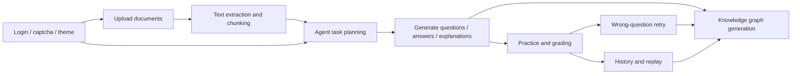

# EduSpark Phase 7 / Phase 6 Expansion Design

## Scope

This design defines the next two product phases for EduSpark Agent, with a deliberate build order:

1. **Phase 7 first**: complete the learning loop and the standalone knowledge graph experience.
2. **Phase 6 second**: rebuild the front-end experience and strengthen login and visual polish.

The decision is intentional. The product should first stabilize the learning workflow and data model, then receive a full visual and interaction overhaul. This avoids reworking the UI twice when the core workflow changes.

Out of scope for this round:

- Production deployment hardening
- Multi-tenant organizations or roles
- Refresh token flow
- OCR for scanned PDFs
- Browser-based collaborative editing

## Current Baseline

The project already has the following foundations:

- React frontend with authenticated workspace pages, document upload, worksheet generation, history, and knowledge graph entry points.
- Spring Boot backend with JWT auth, user-scoped paths, document/task persistence, worksheet generation, and SSE task streaming.
- Qwen-compatible AI integration path through the existing Spring AI configuration.
- Existing visual work with glass panels, theme switching, page intro blocks, and a dedicated knowledge graph page.

The remaining gaps are mostly product-level:

- The learning workflow is still split across several surfaces.
- Practice, grading, wrong-question review, and replay are not yet a single coherent loop.
- Knowledge graph is conceptually important and should be a first-class product line.
- The login and page styling are already improved, but the overall visual system still needs a unified, stronger identity.

## Product Direction

The product should be positioned as:

**An education AI workspace that turns uploaded materials into practice, feedback, review, and knowledge structure.**

The product should not be framed as:

- a pure question generator
- a document parser only
- a chat assistant with a few extra buttons

This distinction matters because it determines how pages, data models, and interaction flows should be organized.

## Phase 7: Core Learning Loop and Knowledge Graph

### Goal

Complete the end-to-end educational workflow:

**upload material -> extract text -> agent plans task -> generate questions and answers -> practice -> grading -> wrong-question retry -> history replay -> knowledge graph**

### Features

#### 1. Document Center

- Support visible material management, not hidden background upload.
- Keep multi-format upload as the primary entry:
  - TXT
  - MD
  - PDF
  - DOCX
  - CSV
- Show upload progress.
- Show parse state and extraction result preview.
- Support document deletion and re-index triggers.

#### 2. Agent Task Orchestration

- Accept a natural-language learning request.
- Let the agent infer suitable output shape rather than forcing a rigid template.
- Support adaptive generation:
  - question type selection
  - difficulty selection
  - answer generation
  - explanation generation
  - knowledge point tagging
- Keep the agent thought process visible in a timeline.

#### 3. Worksheet Studio

- Separate practice and explanation into two tabs.
- Keep practice tab clean and answer-focused.
- Keep explanation tab rich enough to show:
  - standard answers
  - scoring hints
  - knowledge points
  - short reasoning steps
- Support export to Word as a delivery format.

#### 4. Grading and Wrong-Question Loop

- Grade objective question types deterministically when possible.
- Keep short-answer grading behind a service boundary so the model can be swapped later.
- Mark wrong questions clearly.
- Generate retry questions from wrong items.
- Record feedback in a reusable structure.

#### 5. History and Replay

- Move history out of the workspace homepage.
- Support collapsible logs.
- Support task replay and result reopening.
- Keep history searchable and scannable.

#### 6. Knowledge Graph

- Make knowledge graph a **standalone top-level section**.
- Do not keep it buried inside the main workspace.
- Use **Canvas as the primary interaction surface**.
- Use **Mermaid only as a secondary output / simplified preview mode**.

This choice is deliberate:

- Canvas is better for drag, zoom, pan, progressive expansion, and interactive graph product behavior.
- Mermaid is better for compact previews, exports, and documentation.

### Knowledge Graph Behavior

The graph should support:

- concept nodes and relationship edges
- zoom and pan
- node focus and detail drawer
- relationship highlighting
- source traceability back to uploaded content
- graph export to JSON
- optional Mermaid export for simplified sharing

### Backend Design

The backend should keep the current user-scoped structure and add or extend the following concepts:

- `edu_document`
  - parse status
  - preview text
  - indexing status
  - source metadata

- `edu_worksheet`
  - generated question set
  - answer set
  - explanation set
  - knowledge point tags

- `edu_worksheet_attempt`
  - answers
  - score
  - grading result
  - wrong-question summary

- `edu_knowledge_graph`
  - title
  - source document ids
  - graph JSON
  - status

API families to keep or add:

- `POST /api/users/{userId}/documents`
- `GET /api/users/{userId}/documents`
- `GET /api/users/{userId}/documents/{documentId}`
- `DELETE /api/users/{userId}/documents/{documentId}`
- `POST /api/users/{userId}/tasks`
- `GET /api/users/{userId}/tasks/{taskId}`
- `GET /api/users/{userId}/tasks/{taskId}/logs`
- `GET /api/users/{userId}/tasks/{taskId}/artifacts`
- `GET /api/users/{userId}/tasks/{taskId}/stream`
- `POST /api/users/{userId}/worksheets/{worksheetId}/attempts`
- `POST /api/users/{userId}/worksheets/{worksheetId}/retry-mistakes`
- `POST /api/users/{userId}/knowledge-graphs`
- `GET /api/users/{userId}/knowledge-graphs`
- `GET /api/users/{userId}/knowledge-graphs/{graphId}`
- `DELETE /api/users/{userId}/knowledge-graphs/{graphId}`

### Frontend Design

Recommended page structure:

- `WorkspacePage`
- `WorksheetStudioPage`
- `HistoryPage`
- `KnowledgeGraphPage`
- `ProfilePage`

Recommended reusable components:

- `DocumentCenterPanel`
- `PromptComposer`
- `TaskTimeline`
- `ResultPanel`
- `ArtifactGrid`
- `WorksheetPanel`
- `WrongQuestionPanel`
- `KnowledgeGraphPanel`
- `PageIntro`

The workspace homepage should only keep current-work items. History and knowledge graph should live in their own top-level sections so the home page does not become crowded again.

### Error Handling

- Unsupported file type: `400`
- File has no readable text: `400`
- Indexing failure: keep document record, mark failed, allow retry
- Cross-user access: `403`
- Missing resource: `404`
- Invalid grading payload: retryable error with safe fallback
- AI provider failure: surface an actionable error and preserve partial results where possible

## Phase 6: Frontend UI Redesign and Login Experience

### Goal

Rebuild the front-end visual system so the product feels like a polished education AI workspace instead of a dense utility page.

### Visual Direction

The preferred style is:

- transparent white and deep black as the core palette
- glassmorphism with clearer outlines and subtle shadow depth
- liquid, flowing motion in backgrounds and panels
- bright but controlled color accents
- Apple-like spatial calm with Google-like energy highlights

This should feel:

- premium
- calm
- energetic
- readable
- non-crowded

### Features

#### 1. Login Enhancement

- Add graphical captcha if the backend contract is extended for it.
- Keep login/register split clear.
- Use better error handling and stronger feedback states.
- Add exit login and local session cleanup.

#### 2. Theme System

- Support a clear theme switch.
- Theme changes should animate with a gradient transition.
- Keep the default experience bright and clean.
- Allow darker high-contrast views for graph and result-heavy screens.

#### 3. Page Layout Rebuild

- Make every top-level page have a concise introduction.
- Reorganize workspace modules into clearer zones.
- Move history content out of the home view.
- Keep knowledge graph as a parallel top-level section.

#### 4. Motion and Atmosphere

- Keep the flowing background effect, but do not let it fight with content.
- Make panels translucent with visible shape and depth.
- Keep motion continuous and polished, not noisy.
- Use progress animation, hover lift, and soft focus cues.

### Frontend State Model

The front-end should continue using:

- authenticated user session in `localStorage`
- current `userId`
- current theme preference
- active workspace view

The UI should not introduce a second state source that conflicts with the session or theme storage.

### Error Handling

- Login error: show concise, human-readable message
- Captcha failure: block submit until refreshed
- Theme load failure: fall back to default theme
- Layout overflow: always prefer wrapping and responsive stacking

## Contract-First Requirements

Before implementation begins, update the following contracts:

- frontend API types
- task / worksheet / graph DTOs
- document status enums
- login / captcha response shape if captcha is adopted

The contract order matters:

1. document and worksheet data shapes
2. knowledge graph JSON shape
3. grading and replay result shapes
4. login experience contracts

## Data Flow

## Testing Strategy

### Backend

- user-scoped integration tests for all document, task, worksheet, replay, and graph APIs
- grading tests for objective question types
- fallback tests for short-answer grading and AI failure conditions
- knowledge graph JSON validation tests

### Frontend

- login and register states
- workspace navigation and module visibility
- practice / explanation tab behavior
- wrong-question retry flow
- history replay and log collapse
- graph render basics in Canvas mode
- theme switch and responsive layout

### Full Verification

- backend `mvn package`
- frontend `npm exec vitest run`
- frontend `npx tsc -b`
- frontend `npm exec vite build`

## Recommended Implementation Order

### Step 1: Phase 7 foundation

- finalize document, worksheet, grading, replay, and graph contracts
- keep knowledge graph JSON shape stable
- ensure user-scoped API boundaries are explicit

### Step 2: Phase 7 build

- document center
- worksheet studio
- grading and retry loop
- history center
- knowledge graph page

### Step 3: Phase 6 build

- login experience improvements
- theme switch and gradient transitions
- global glass / liquid visual language
- workspace layout cleanup

### Step 4: polish

- micro-interactions
- loading and empty states
- responsive correctness
- content density tuning

## Assumptions

- The project keeps the current Qwen-compatible agent direction.
- Mermaid is used as an auxiliary format, not the main graph runtime.
- Production deployment remains postponed.
- The new UI should remain lightweight and avoid adding a heavy UI framework.

